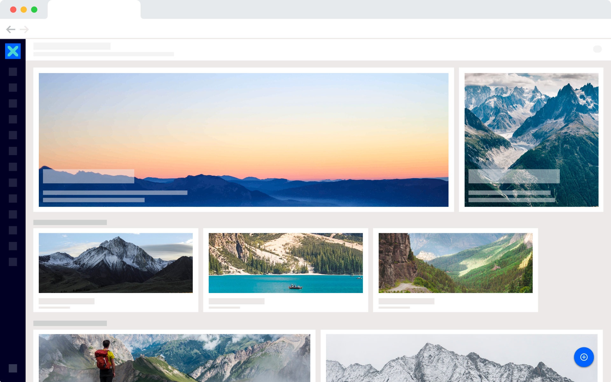

Hi there! :wave:

I'm an Enterprise Content Management specialist, and Nuxeo Platform passionate. I'm working at [Nuxeo](www.nuxeo.com) in the Product team. I'm a all-round worker, with the will to share my knowledge, best practices and tips and tricks to speed up any Nuxeo application implementations. I'm not a developer expert, and my contributions can be probably easily improved, but let's say I can do few cool things with JS, CSS, HTML and Web Components :wink:

As you can see, I'm the main contributor of the [Nuxeo Community Cookbook](https://github.com/nuxeo/nuxeo-studio-community-cookbook) aiming at helping the Nuxeo Community to enrich Nuxeo Studio projects. It provides a list of features and visual elements ready to be copy-pasted. 

I'm working with my colleague [Manon](https://github.com/manonlumeau) on the [Nuxeo Documentation Website](https://doc.nuxeo.com) to provide the more exhautive and usefull information on our Platform.
